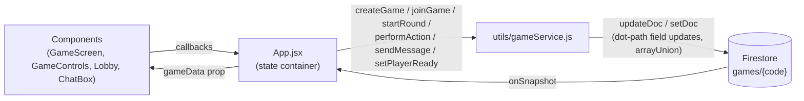

There is no game server. Every client talks directly to Firestore: writes go through small service modules, and reads arrive as real-time snapshot subscriptions. Firestore is the single source of truth; React state is just a mirror of the current game document.

## Routing

`src/AppRouter.jsx` is a minimal state-based router — no URL routing library. A single `currentView` state switches between three screens:

- `home` — `HomePage.jsx`, the Game Hub cards
- `ego` — `App.jsx`, the Ego Poker app (with a floating "← Home" button)
- `stratego` — `stratego/StrategoApp.jsx`

## Ego Poker data flow



1. **`App.jsx`** owns all client state: player identity, the active `gameId`, and `gameData`. On mount it loads or generates a device UUID from `localStorage` and checks for an existing profile via `profileService`.
2. When `gameId` is set, an effect attaches `onSnapshot(doc(db, 'games', gameId))`. Every remote write — by any player — pushes a fresh document into `setGameData`, re-rendering the whole game.
3. All mutations live in **`utils/gameService.js`**: `createGame`, `joinGame`, `startRound`, `performAction`, `setPlayerReady`, `endGame`, `sendMessage`. They write with `updateDoc` using dot-path keys (e.g. `players.<id>.folded`) and `arrayUnion` for append-only logs (`actions`, `chatLog`).
4. `performAction` is the rules engine. It re-reads the document, guards against acting after the round ended, applies Fold/Call/Raise semantics, advances `currentTurn` to the next non-folded player (sorted-ID order), then runs `checkRoundStillActive`, which handles fold-out wins, detects showdowns, evaluates hands with `pokersolver`, applies ± confidence scoring, and checks the 50-point win condition.

<Note>
Coordination logic runs on whichever client acted — including the "everyone is ready → start next round" check, which runs in a `GameScreen` effect **on the host's client only**. If the host closes their tab between rounds, the next round never auto-starts.
</Note>

## Key files

| File | Responsibility |
| --- | --- |
| `src/App.jsx` | State container, Firestore subscription, wires services to UI |
| `src/utils/gameService.js` | All game mutations and round/showdown/win logic |
| `src/utils/gameUtils.js` | UUID generator, 52-card deck builder (`RS` string format, e.g. `AS`, `TH`) |
| `src/utils/profileService.js` | Register / reconnect / check profiles in the `profiles` collection |
| `src/components/GameScreen.jsx` | Circular table layout, seat rotation (you at bottom), winner banners, game-over overlay |
| `src/components/GameControls.jsx` | Fold / Call and the 1–10 raise grid, gated on `currentTurn` |
| `src/components/Lobby.jsx` | Registration and create/join forms |
| `src/components/ChatBox.jsx`, `PlayerList.jsx` | Sidebar chat and player roster |

## The `games` document

A single Firestore document holds an entire game:

```json
{
  "status": "waiting | in-progress | ended",
  "host": "<playerId>",
  "players": {
    "<playerId>": {
      "name": "Ava",
      "folded": false,
      "totalConfidence": 12,
      "roundConfidence": 3,
      "ready": false,
      "lastSeen": 1700000000000
    }
  },
  "hands": { "<playerId>": ["AS", "TH"] },
  "faceUps": ["2C", "9D", "QS", "KH", "4S"],
  "deck": ["..."],
  "confidence": 3,
  "currentTurn": "<playerId>",
  "currentActors": ["<playerId>"],
  "roundNumber": 2,
  "roundActive": true,
  "winner": null,
  "winReason": null,
  "actions": [],
  "chatLog": []
}
```

<Warning>
Hole cards for **all players** live in the shared document, and the client subscribes to the whole thing — the UI hides opponents' cards, but they are visible in the network payload. Fine for a friendly demo, not for adversarial play.
</Warning>

## Stratego module

`src/stratego/` is a parallel, self-contained implementation of the same pattern:

- `services/strategoService.js` — create/join/setup/move mutations against `strategoGames`, plus `subscribeToStrategoGame` wrapping `onSnapshot`
- `utils/strategoConstants.js` — board size, lake positions, piece roster, setup rows, coordinate helpers
- `utils/strategoRules.js` — pure functions: `isMovable`, `getValidMoves`, `resolveBattle`, `checkWinCondition`
- `components/` — `StrategoLobby`, `StrategoSetup`, `StrategoGame` (board + interaction), `StrategoBattle` (reveal overlay), `StrategoCapturedPanel`, `StrategoNoteEditor`, `StrategoGameOver`

The board is stored as a flat map of position index → piece object (`{ id, rank, color, revealed }`). Battle resolution runs client-side in `makeMove`, which writes the resolved board, `lastBattle`, `lastMove`, and captured pieces in one `updateDoc`. Player notes never touch Firestore — they live in `localStorage`.

## The planned OO refactor

The README notes that `main` is about to transition to an **object-oriented layered architecture**, with the functional implementation preserved at the `stable-v1-functional` tag. The scaffolding already exists in `src/models/`:

- `Card` — validated rank/suit value object
- `Deck` — 52 cards with Fisher–Yates `shuffle()` and `deal()`
- `Hand` — card collection with add/reset
- `Player` — encapsulates hand, score, fold state, `bet()` (minimum 1), `awardPoints()`, `resetRoundState()`
- `Round` — round number, players, center cards

<Note>
None of these classes are imported by the running app — the live game uses the functional `gameService`/`gameUtils` path exclusively. The models are also not yet consistent with it: `Card` uses lowercase suits (`h d c s`) while the live deck uses uppercase (`S H D C`), `Round.deal()` is an empty stub, and `Round.js` currently ends with `export default Card;` and a `toString()` copied from `Card` — importing it would throw. Treat `src/models/` as in-progress scaffolding for the refactor, not working code.
</Note>
